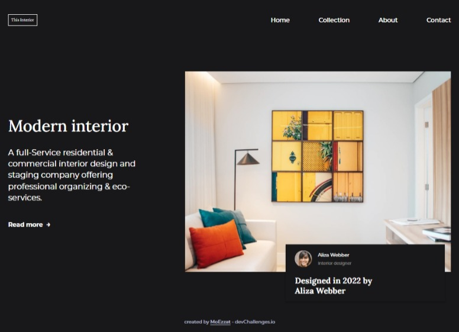

<!-- Please update value in the {}  -->

<h1 align="center">interior consultant</h1>

   Solution for a challenge from  <a href="http://devchallenges.io" target="_blank">Devchallenges.io</a>.

  <h3>
    <a href="https://{your-demo-link.your-domain}">
      Demo
    </a>    
  </h3>

<!-- TABLE OF CONTENTS -->

## Table of Contents

- [Overview](#overview)
  - [Built With](#built-with)
- [Features](#features)
- [Contact](#contact)

<!-- OVERVIEW -->

## Overview

<!-- This section should list any major frameworks that you built your project using. Here are a few examples.-->

- `HTML`
- `CSS`
- `SASS`
- `JavaScript`

## Features

<!-- List the features of your application or follow the template. Don't share the figma file here :) -->

This application/site was created as a submission to a [DevChallenges](https://devchallenges.io/challenges) challenge. The [challenge](https://devchallenges.io/challenges/Jymh2b2FyebRTUljkNcb) was to build an application to complete the given user stories.

## Contact

- GitHub [@moezzat-git](https://{github.com/your-usermame})
- Twitter [@M0hamed_Ezzat](https://{twitter.com/your-username})
